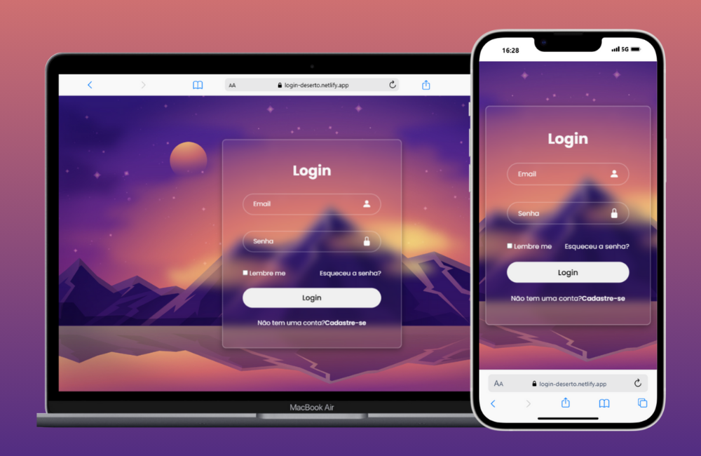

<h1>Login Deserto</h1>

<b><a href="https://login-deserto.netlify.app/" target="_blank">Ver Projeto</a></b>
<b><a href="https://www.figma.com/design/taxupFGFxGLC9hWzu5CGaB/login-Deserto?node-id=0-1&node-type=canvas&t=IvTGVuer1FS3atLV-0" target="_blank">Templete no Figma</a></b>

<h3>Login  Form</h3>
<ul>
<li>Sistema de Login com HTML e CSS</li>
<li>Com um fundo em tema de deserto</li>
<li>Efeito de Vidro no Formulario</li>
<li>Um site adaptado a vária telas e muito legal de se fazer</li>
</ul>

